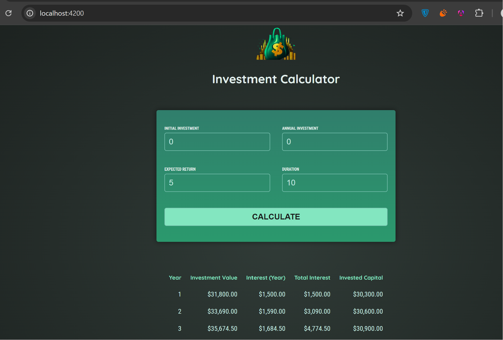

# Investment Calculator - An investment calculator app.

## Welcome! 👋
This is an investment calculator app that allows one to enter values for an investment and calculate it over a specified period of years. During this course project, I focused more on understanding Angular's standalone components and also on major Angular concepts like Components, Signals, Databinding, Services & dependency injection, Forms, Pipes, and their working principle!

## How To Run? 🤔
Download this code either as a `zip file` or use the `git clone` command to clone it.
Then, open the project folder in your editor and on the integrated terminal:
-  Run `npm install` to install all the packages used for this project.
After the installation,
- Run `ng serve` to run the project on your browser localhost.
    That's all you'd need to do 🙂

## Want To Contribute? 
Feel free to open a pull request on this repository is there's any feature you'd like to add to this app!

## Have A Feedback? 
Giving feedback is appreciated, if you any to give on this project please let me know at beatriceebirim@gmail.com.

**Happy Coding 💪**